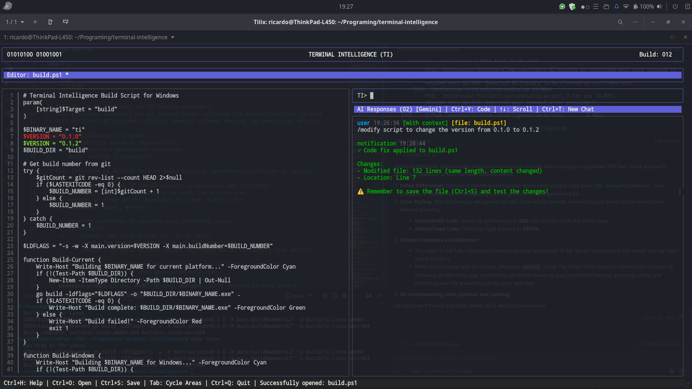

# Terminal Intelligence (TI)

A lightweight CLI-based IDE with integrated AI assistance through Ollama. Features a split-window terminal interface with an integrated code editor and AI assistant for creating, editing, and testing scripts and markdown documents.



## Features

- **Split-Window Interface**: Vertical split with editor on the left and AI assistant on the right
- **Code Editor**: Basic text editing with line numbers for bash, shell, PowerShell, and markdown files
- **AI Integration**: Context-aware AI assistance powered by Ollama or Gemini
- **Agentic Code Fixing**: AI autonomously reads, analyzes, and fixes code directly in the editor
- **File Management**: Create, open, save, and delete files
- **Command Execution**: Run system commands and execute scripts
- **Keyboard Shortcuts**: Efficient keyboard-driven workflow
- **Session Management**: Unsaved changes confirmation on exit
- **Cross-Platform**: Runs on Linux, Windows, and macOS

## Agentic Code Fixing

The AI assistant can autonomously fix code issues in your open files. Simply describe what you want to change, and the AI will read your code, generate a fix, and apply it directly to the editor.

### How It Works

The AI automatically detects when you're requesting a code fix versus asking a conversational question. When you request a fix, the AI:

1. Reads the currently open file (including unsaved changes)
2. Analyzes your request along with the code context
3. Generates a precise code fix
4. Applies the fix directly to the editor
5. Notifies you of the changes made

Your file is marked as modified but not automatically saved, giving you full control to review and save when ready.

### Agentic vs Conversational Modes

**Agentic Mode** (AI modifies code):
- Triggered by fix-related keywords: "fix", "change", "update", "modify", "correct"
- AI reads the file, generates a fix, and applies it automatically
- File is marked as modified but not saved
- You receive a summary of changes made

**Conversational Mode** (AI provides guidance):
- Triggered by questions or informational messages
- AI responds with explanations, suggestions, or answers
- No code modifications are made
- Use this for learning, debugging help, or general questions

**Explicit Commands**:
- `/fix <your request>` - Force agentic mode (AI will modify code)
- `/ask <your question>` - Force conversational mode (AI won't modify code)
- `/preview <your request>` - Preview changes before applying them
- `/model` - Display current agent and model information
- `/config` - Edit configuration settings interactively
- `/help` - Display keyboard shortcuts and agent commands

### Usage Examples

#### Basic Fix Request

```
You: fix the syntax error on line 15
```

The AI detects "fix" keyword, reads your file, identifies the syntax error, and applies the correction.

#### Using /fix Command

```
You: /fix add error handling to the main function
```

Explicitly requests agentic mode. The AI adds error handling code to your main function.

#### Using /ask Command

```
You: /ask how does this function work?
```

Explicitly requests conversational mode. The AI explains the function without modifying code.

#### Using /preview Command

```
You: /preview refactor this to use a switch statement
```

The AI shows you what changes it would make before applying them. You can then approve or request modifications.

#### Using /model Command

```
You: /model
```

The AI displays the current agent (ollama or gemini) and model being used (e.g., llama2, gemini-2.5-flash-lite). If using Gemini, it also displays the API key from the configuration.

#### Using /config Command

```
You: /config
```

Opens an interactive configuration editor where you can modify settings without leaving the application:
- Navigate fields with Up/Down or K/J keys
- Press Enter to edit a field value
- Press Enter again to save the edited value
- Press Esc to save all changes and exit config mode

The configuration is saved to `~/.ti/config.json` and applied immediately without restarting the application.

#### Using /help Command

```
You: /help
```

The AI displays a comprehensive help message including:
- All keyboard shortcuts (same as Ctrl+H)
- Agent commands (/fix, /ask, /preview, /model, /config, /help)
- Fix keywords (fix, change, update, modify, correct) with descriptions

You can also press Ctrl+H at any time to see the help dialog with all keyboard shortcuts and agent commands organized by category.

#### Multiple Changes

```
You: update the function to handle edge cases and add comments
```

The AI applies multiple changes in a single operation: adds edge case handling and documentation comments.

### What Gets Modified

- The AI only modifies the currently open file in the editor
- Changes are applied immediately and visible in the editor
- The file is marked as modified (indicated in the UI)
- You must save manually with `Ctrl+S` to persist changes
- You can undo changes using standard editor undo mechanisms

### Best Practices

1. **Be Specific**: Clearly describe what you want to change
   - Good: "fix the off-by-one error in the loop"
   - Less clear: "fix the bug"

2. **One File at a Time**: Open the file you want to modify before requesting fixes

3. **Review Changes**: Always review AI-generated changes before saving

4. **Test Your Code**: After applying fixes, test your code to ensure it works as expected

5. **Use /ask for Questions**: When you want explanations without modifications, use `/ask`

6. **Use /preview for Safety**: Preview complex changes before applying them

### Error Handling

The AI handles errors gracefully:

- **No File Open**: You'll be prompted to open a file first
- **AI Service Unavailable**: You'll be notified to check your Ollama or Gemini connection
- **Invalid Fix**: The AI won't apply fixes that are syntactically invalid
- **Application Failure**: Original content is preserved if something goes wrong

### Supported File Types

Agentic code fixing works with:
- Bash scripts (`.sh`, `.bash`)
- Shell scripts (`.sh`)
- PowerShell scripts (`.ps1`)
- Markdown documents (`.md`)
- Python scripts (`.py`)

## Requirements

- Go 1.21 or higher
- Ollama (optional, for AI features)

## Installation

### From Source

```bash
# Clone the repository
git clone https://github.com/user/terminal-intelligence.git
cd terminal-intelligence

# Build the application
make build

# Install to local system (optional)
make install
```

### Compile in windows
```powershell
 go build -o .\build\ti.exe
```

### Pre-built Binaries

Download pre-built binaries for your platform from the releases page.

## Configuration

The application supports configuration through a JSON file located at `~/.ti/config.json` (or `%USERPROFILE%\.ti\config.json` on Windows).

### Configuration File

On first run, if no config file exists, the application will automatically create a default `config.json` with example values at `~/.ti/config.json`.

You can edit this file to customize your settings. The application will load it automatically on subsequent runs.

**Default Configuration (Ollama):**

```json
{
  "agent": "ollama",
  "model": "qwen2.5-coder:3b",
  "ollama_url": "http://localhost:11434",
  "gemini_api": "",
  "workspace": "/home/user/ti-workspace"
}
```

**Example Gemini Configuration:**

```json
{
  "agent": "gemini",
  "model": "gemini-3-flash-lite",
  "ollama_url": "",
  "gemini_api": "your-api-key-here",
  "workspace": "/home/user/project-workspace"
}
```

**Configuration Fields:**

- `agent`: AI provider - `"ollama"` or `"gemini"`
- `model`: Model name (e.g., `"llama2"`, `"qwen2.5-coder:3b"`, `"gemini-3-flash-lite, gemini-3-pro-preview"`)
- `ollama_url`: Ollama server URL (only for Ollama provider)
- `gemini_api`: Gemini API key (required for Gemini provider)
- `workspace`: Workspace directory path (absolute path to your workspace folder)

**Note:** Command-line flags override config file values.

## Usage

[Introduction](./docs/USAGE.md)

```

### Keyboard Shortcuts

| Shortcut | Action |
|----------|--------|
| `Tab` | Cycle between Editor, AI Input, and AI Response areas |
| `Ctrl+S` | Save current file |
| `Ctrl+R` | Execute current script |
| `Ctrl+Enter` | Send message to AI |
| `Ctrl+H` | Show help dialog with all shortcuts |
| `Ctrl+C` or `Ctrl+Q` | Quit application |

Note: You can also type `/help` in the AI chat to see all keyboard shortcuts and agent commands.

### Workflow Example

1. Launch the application
2. Create a new file in the editor
3. Write your code or markdown
4. Press `Ctrl+S` to save
5. Press `Tab` to switch to AI pane
6. Ask the AI for help with your code
7. Press `Tab` to return to editor
8. Press `Ctrl+R` to execute your script

## Building

### Build for Current Platform

```bash
make build
```

### Build for All Platforms

```bash
make all-platforms
```

This creates binaries for:
- Linux (amd64)
- Windows (amd64)
- macOS (amd64 and arm64)

### Build Targets

```bash
make linux      # Build for Linux
make windows    # Build for Windows
make darwin     # Build for macOS
```

## Testing

### Run All Tests

```bash
make test
```

### Run Specific Test Suites

```bash
make test-unit          # Unit tests only
make test-property      # Property-based tests only
make test-integration   # Integration tests only
```

### Test Coverage

```bash
make test-coverage
```

This generates a coverage report in `coverage.html`.

## Project Structure

```
terminal-intelligence/
├── internal/
│   ├── types/          # Core data structures and types
│   ├── filemanager/    # File system operations
│   ├── executor/       # Command and script execution
│   ├── ollama/         # Ollama AI client
│   └── ui/             # Bubble Tea UI components
│       ├── app.go      # Main application
│       ├── editor.go   # Editor pane
│       └── aichat.go   # AI chat pane
├── tests/
│   ├── unit/           # Unit tests for specific examples
│   ├── property/       # Property-based tests with gopter
│   └── integration/    # End-to-end integration tests
├── main.go             # Application entry point
├── Makefile            # Build automation
├── go.mod              # Go module definition
└── README.md           # This file
```

## Architecture

The application follows a clean architecture with clear separation of concerns:

- **UI Layer**: Bubble Tea components for terminal interface
- **Business Logic**: File management, command execution, AI communication
- **Data Layer**: File system operations

### Key Components

- **App**: Main Bubble Tea application orchestrating all components
- **EditorPane**: Code editor with syntax highlighting and file editing
- **AIChatPane**: AI interaction pane with conversation history
- **FileManager**: Handles all file system operations
- **CommandExecutor**: Executes system commands and scripts
- **OllamaClient**: Communicates with Ollama service via REST API

## Testing Strategy

The project uses a dual testing approach:

- **Unit Tests**: Verify specific examples, edge cases, and error conditions
- **Property-Based Tests**: Verify universal properties across all inputs using gopter
- **Integration Tests**: Verify complete user workflows

### Test Coverage

- File operations (create, read, write, delete)
- Command execution (stdout, stderr, exit codes)
- AI integration (message history, context inclusion)
- UI components (editor, AI pane, split-window layout)
- Keyboard controls (shortcuts, focus management)
- Session management (unsaved changes, exit confirmation)

## Configuration

The application can be configured via:

1. **Configuration file** at `~/.ti/config.json` (loaded automatically if present)
2. **Command-line flags** (override config file values)
3. **Default configuration** (used when no config file or flags provided)

### Configuration Priority

Command-line flags > Config file > Built-in defaults

### Default Configuration

- **Workspace Directory**: `~/ti-workspace`
- **Ollama URL**: `http://localhost:11434`
- **Default Model**: `llama2`
- **Tab Size**: 4 spaces
- **Auto Save**: Disabled

## Cross-Platform Support

The application is designed to run on:
- **Linux**: Tested on Ubuntu 20.04+
- **Windows**: Tested on Windows 10+
- **macOS**: Tested on macOS 11+ (Intel and Apple Silicon)

## Development

### Prerequisites

- Go 1.21 or higher
- Make (for build automation)
- golangci-lint (optional, for linting)

### Development Commands

```bash
make fmt        # Format code
make lint       # Run linter
make run        # Build and run
make clean      # Clean build artifacts
```

## Contributing

Contributions are welcome! Please ensure:

1. All tests pass (`make test`)
2. Code is formatted (`make fmt`)
3. Linter passes (`make lint`)
4. New features include tests

## License

TBD

## Acknowledgments

- [Bubble Tea](https://github.com/charmbracelet/bubbletea) - Terminal UI framework
- [Lip Gloss](https://github.com/charmbracelet/lipgloss) - Terminal styling
- [Ollama](https://ollama.ai/) - Local LLM runtime
- [gopter](https://github.com/leanovate/gopter) - Property-based testing
