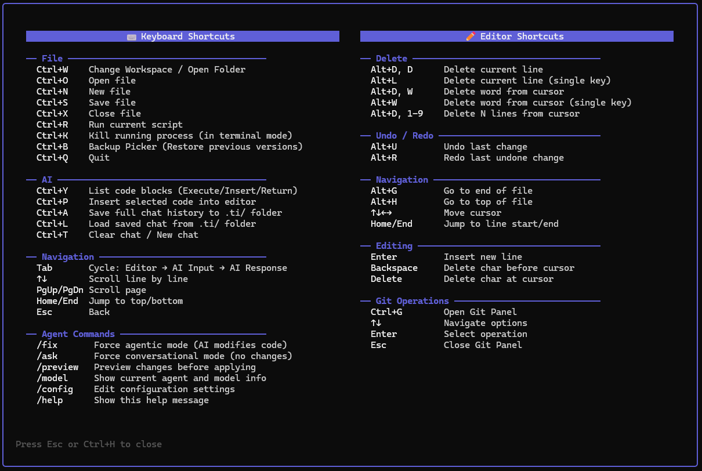

# Terminal Intelligence (TI)

A lightweight CLI-based IDE with integrated AI assistance through Ollama, Gemini & Bedrock. Features a split-window terminal interface with an integrated code editor and AI assistant for creating, editing, and testing scripts and markdown documents.

### ~~ ***Early Days but whatch this space*** ~~

### Menu View & Shotcuts
Quick overview of current menu shotcuts and key combinations


---

# [**Additional Screenshot Showcase →**](SHOWCASE.md)

## Features

- **Split-Window Interface**: Vertical split with editor on the left and AI assistant on the right
- **Multi-Language Support**: Edit and run Bash, PowerShell, Python, Go, and Markdown files
- **Auto-Install Detection**: Automatically detects missing language runtimes and offers to install them
- **Code Editor**: Syntax-aware text editing with line numbers and file type detection
- **AI Integration**: Context-aware AI assistance powered by Ollama, Gemini, or AWS Bedrock
- **Agentic Code Fixing**: AI autonomously reads, analyzes, and fixes code directly in the editor
- **Chat History Management**: Automatic session saving and reload with Ctrl+L
- **Integrated Git Operations**: Full Git workflow support with visual panel interface
- **File Management**: Create, open, save, and delete files
- **Command Execution**: Run scripts and programs with Ctrl+R (auto-detects file type)
- **Go Development**: Full support for running Go programs and tests
- **Keyboard Shortcuts**: Efficient keyboard-driven workflow
- **Session Management**: Unsaved changes confirmation on exit
- **Cross-Platform**: Runs on Linux, Windows, and macOS
- **Language Support**: Shell, Bash, Python, Go, Markdown

## Integrated Git Operations

Terminal Intelligence includes a built-in Git client powered by go-git, providing a complete Git workflow without requiring external Git installation. Access all Git operations through an intuitive visual panel interface.

### Opening the Git Panel

Press `Ctrl+G` to open the Git Operations panel. The panel provides:
- Three input fields for repository URL, username, and password/token
- Eight operation buttons organized into logical groups
- Real-time status and error messages
- Automatic credential detection from existing repositories

### Git Operations

The Git panel organizes operations into three logical groups:

**Remote Operations** (Clone, Pull, Fetch)
- **Clone**: Clone a repository from a remote URL to your workspace
- **Pull**: Fetch and merge changes from the remote repository
- **Fetch**: Download changes from remote without merging

**Local to Remote Workflow** (Stage, Commit, Push)
- **Stage**: Stage all modified and untracked files for commit
- **Commit**: Create a commit with staged changes (requires commit message)
- **Push**: Push local commits to the remote repository

**Info and Undo** (Status, Restore)
- **Status**: View repository status (modified, staged, and untracked files)
- **Restore**: Discard all uncommitted changes and restore to last commit

### Git Workflow Example

1. **Check Status**: Press `Ctrl+G`, select Status button, press Enter
2. **Stage Changes**: Navigate to Stage button, press Enter
3. **Commit**: Navigate to Commit button, press Enter
   - Enter your commit message in the input field
   - Press Enter to commit (message cannot be empty)
4. **Push**: Navigate to Push button, press Enter to push to remote

### Authentication

The Git panel supports multiple authentication methods:

**GitHub Personal Access Token (Recommended)**
- Username: Your GitHub username
- Password: GitHub Personal Access Token (ghp_...)
- Tokens are securely stored in repository configuration

**Username/Password**
- Username: Your Git username
- Password: Your Git password
- Works with most Git hosting services

**Credential Auto-Detection**
- When opening the panel in an existing repository, credentials are automatically loaded from `.git/config`
- Stored credentials are used for subsequent operations

## Tested LLMs

Terminal Intelligence has been tested and verified to work with the following AI models:

| Provider | Model | Notes |
|----------|-------|-------|
| **Ollama** | `qwen2.5-coder:3b` | Recommended for coding tasks |
| | `qwen2.5-coder:1.5b` | Lightweight coding model |
| | `deepseek-coder-v2:16b` | Advanced coding capabilities |
| **Gemini** | `gemini-3-flash-preview` | Fast responses |
| | `gemini-3.1-pro-preview` | Advanced reasoning |
| | `gemini-3.1-flash-lite` | Lightweight and fast |
| **AWS Bedrock** | `anthropic.claude-sonnet-4-6` | Best coding performance |
| | `anthropic.claude-haiku-4-6` | Fast and cost-effective |
| | `anthropic.claude-opus-4-6` | Highest intelligence |

**Note:** AWS Bedrock models automatically use inference profiles for optimal performance and cross-region failover.

### Commit Message Input

When the Commit button is selected:
1. Press Enter to show the commit message input field
2. Type your commit message (cannot be empty)
3. Press Enter to create the commit
4. The input field disappears after successful commit

### Features

- **Pure Go Implementation**: No external Git installation required
- **Credential Management**: Secure storage and auto-detection of credentials
- **Visual Feedback**: Real-time status messages for all operations
- **Error Handling**: Clear error messages with actionable guidance
- **Repository Detection**: Automatically detects if current directory is a Git repository
- **Cross-Platform**: Works consistently on Linux, Windows, and macOS

### Technical Details

The Git integration uses:
- **go-git/go-git/v5**: Pure Go Git implementation
- **GitClient** (`internal/git/client.go`): Core Git operations
- **CredentialStore** (`internal/git/credentials.go`): Secure credential management
- **GitPane** (`internal/ui/gitpane.go`): Visual panel interface

For more technical details, see [internal/git/README.md](internal/git/README.md).

## Agentic Code Fixing

The AI assistant can autonomously fix code issues in your open files. Simply describe what you want to change, and the AI will read your code, generate a fix, and apply it directly to the editor.

### How It Works

The AI automatically detects when you're requesting a code fix versus asking a conversational question. When you request a fix, the AI:

1. Reads the currently open file (including unsaved changes)
2. Analyzes your request along with the code context
3. Generates a precise code fix
4. Applies the fix directly to the editor
5. Notifies you of the changes made

Your file is marked as modified but not automatically saved, giving you full control to review and save when ready.

### Agentic vs Conversational Modes

**Agentic Mode** (AI modifies code):
- Triggered by fix-related keywords: "fix", "change", "update", "modify", "correct"
- AI reads the file, generates a fix, and applies it automatically
- File is marked as modified but not saved
- You receive a summary of changes made

**Conversational Mode** (AI provides guidance):
- Triggered by questions or informational messages
- AI responds with explanations, suggestions, or answers
- No code modifications are made
- Use this for learning, debugging help, or general questions

**Explicit Commands**:
- `/fix <your request>` - Force agentic mode (AI will modify code)
- `/ask <your question>` - Force conversational mode (AI won't modify code)
- `/preview <your request>` - Preview changes before applying them
- `/model` - Display current agent and model information
- `/config` - Edit configuration settings interactively
- `/help` - Display keyboard shortcuts and agent commands

### Best Practices

1. **Be Specific**: Clearly describe what you want to change
   - Good: "fix the off-by-one error in the loop"
   - Less clear: "fix the bug"

2. **One File at a Time**: Open the file you want to modify before requesting fixes

3. **Review Changes**: Always review AI-generated changes before saving

4. **Test Your Code**: After applying fixes, test your code to ensure it works as expected

5. **Use /ask for Questions**: When you want explanations without modifications, use `/ask`

6. **Use /preview for Safety**: Preview complex changes before applying them

### Error Handling

The AI handles errors gracefully:

- **No File Open**: You'll be prompted to open a file first
- **AI Service Unavailable**: You'll be notified to check your Ollama or Gemini connection
- **Invalid Fix**: The AI won't apply fixes that are syntactically invalid
- **Application Failure**: Original content is preserved if something goes wrong

### Supported File Types

Agentic code fixing works with:
- Shell scripts (`.sh`, `.bash`)
- PowerShell scripts (`.ps1`)
- Python scripts (`.py`)
- Go source files (`.go`)
- Markdown documents (`.md`)

## Installation

### From Source

```bash
# Clone the repository
git clone https://github.com/user/terminal-intelligence.git
cd terminal-intelligence
```

### Pre-built Binaries

Download pre-built binaries for your platform from the releases page.

## Configuration

Terminal Intelligence supports multiple AI providers (Ollama, Gemini, AWS Bedrock) and can be configured through a JSON file or command-line flags.

For detailed configuration instructions, including:
- Configuration file format and location
- Provider-specific settings (Ollama, Gemini, Bedrock)
- Tested LLM models
- Command-line overrides
- Security best practices
- Troubleshooting guide

See the [Configuration Guide](./docs/CONFIG.md).

**Quick Start:**

```bash
# Edit configuration interactively
```
Mode                 LastWriteTime         Length Name
----                 -------------         ------ ----
-a---          02/03/2026    15:51       13553600 ti-darwin-amd64
-a---          02/03/2026    15:51       12639810 ti-darwin-arm64
-a---          02/03/2026    15:51       12386488 ti-linux-aarch64
-a---          02/03/2026    15:51       13295800 ti-linux-amd64
-a---          02/03/2026    15:51       13813248 ti-windows-amd64.exe
```
# Then press Ctrl+C and type: /config
```