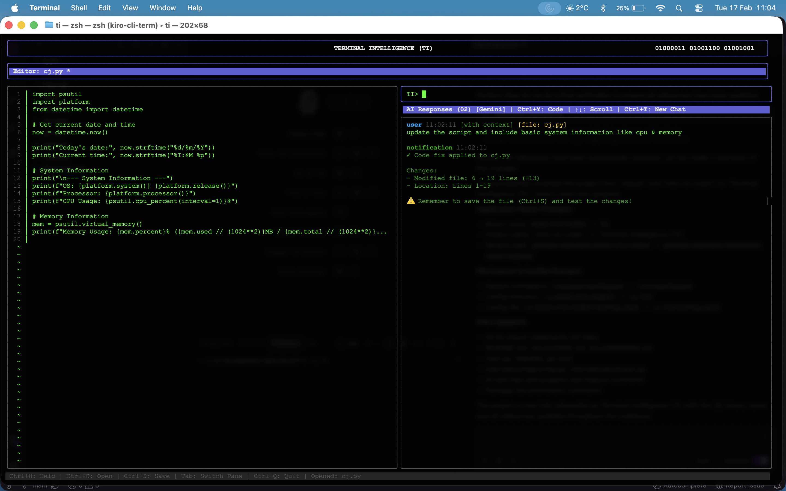
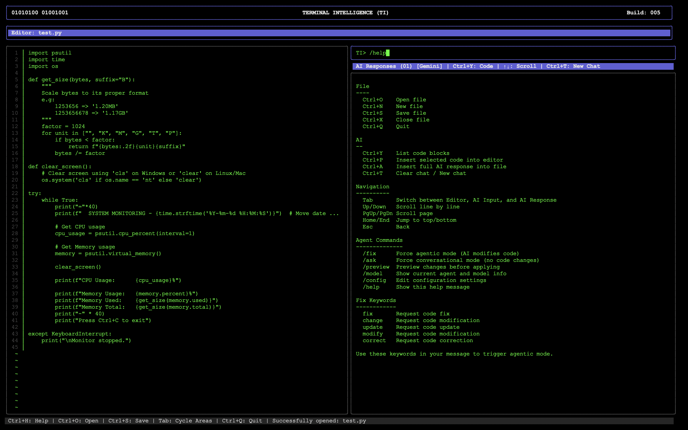
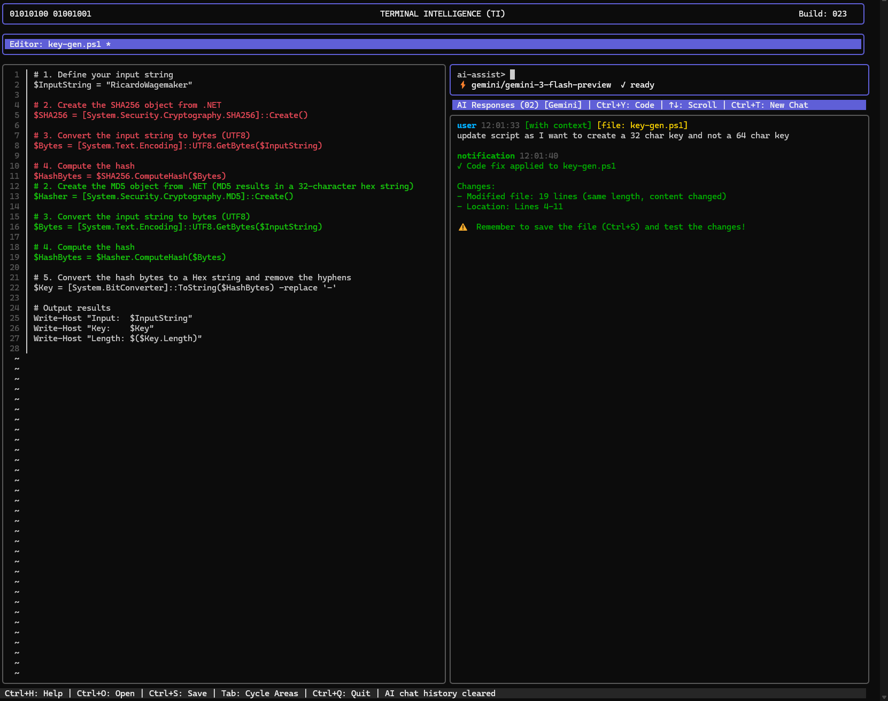
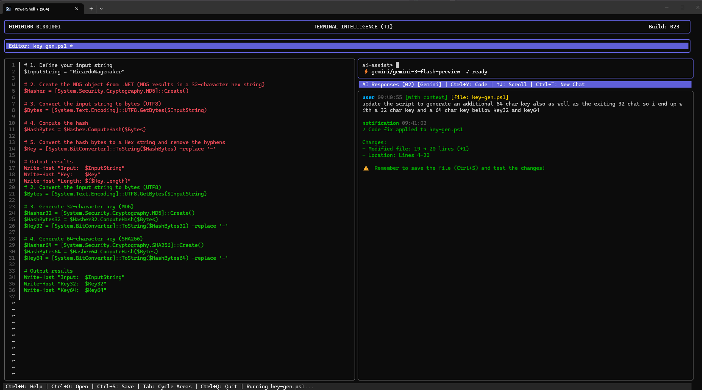
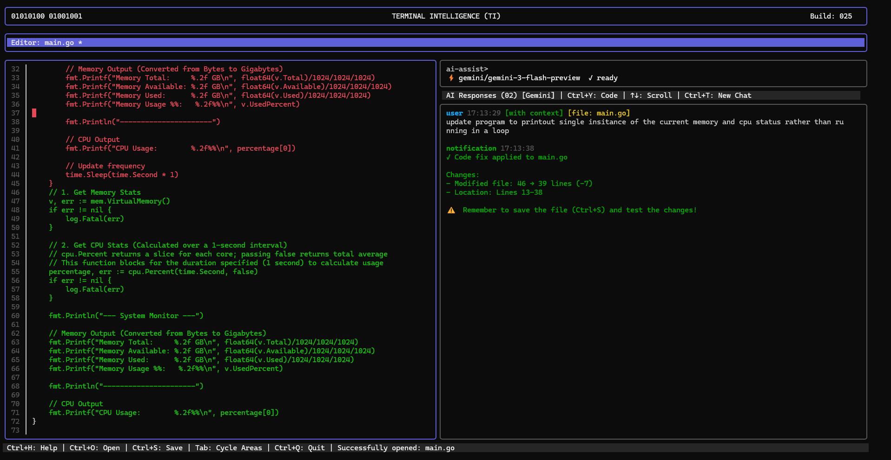
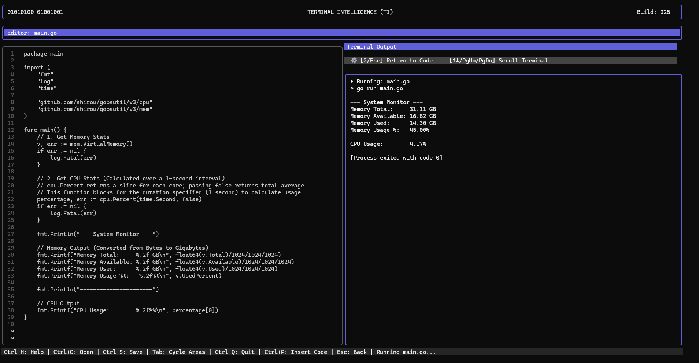

# Terminal Intelligence (TI) - Screenshot Showcase

This document showcases the various features and views of Terminal Intelligence through screenshots.

## Main Interface Views

### First View - Split Window Interface
The main split-window interface showing the code editor on the left and AI assistant on the right.

---

### Second View - AI Interaction
Demonstrating with /help the available commands in the right pane.

---

### Third View - Code Editing
Code editing features with syntax highlighting and line numbers.

---

### Fourth View A - Advanced Features
Advanced features and workflow demonstrations RED OUT and GREEN IN - Updated with Ctrl+S to save changes

---

### Fourth View B - Terminal Output
Terminal output and script another example of code coming in and being removed it will be updated with Ctrl+S on save.

---

### Fourth View C - Complete Workflow
Complete workflow showing editor, AI assistance, and execution in action of the script with Ctrl+R to run the saved script.

---

### Go Language Support - Code Editing
Terminal Intelligence now fully supports Go application development. Experience syntax highlighting, robust context-aware agentic fix features, and seamless editing of `.go` files directly in the split-pane interface.

---

### Go Language Support - Execution and Testing
Run and test your Go programs seamlessly within TI using the `Ctrl+R` hotkey. The environment automatically manages background tasks like module initialization (`go mod init`/`go mod tidy`) and executes `go run` or `go test` according to the active file.

---

## Key Features Demonstrated

- **Split-Window Layout**: Efficient workspace with editor and AI assistant side-by-side
- **Code Editor**: Line numbers, syntax highlighting, and file management
- **AI Integration**: Context-aware assistance powered by Ollama or Gemini
- **Terminal Output**: Real-time command execution and script running
- **Keyboard-Driven**: Fast navigation with comprehensive keyboard shortcuts
- **Cross-Platform**: Consistent experience across Linux, Windows, and macOS

[← Back to README](README.md)
